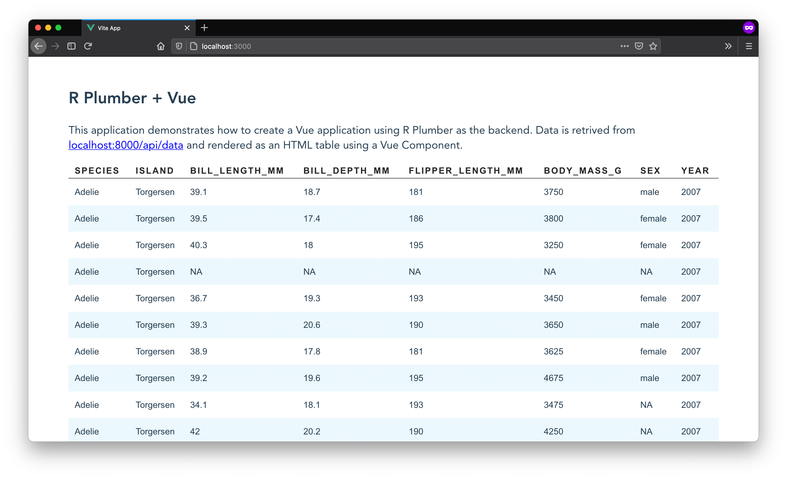

# R Demo using Plumber, Vue, and Vite



The `r-vue-app` demonstrates how to create an Vue application using R plumber as a backend. This demo also uses Vite.

- Backend Tools
    - R Plumber: [https://www.rplumber.io](https://www.rplumber.io)
    - Node: [https://nodejs.org/](https://nodejs.org/)
- Frontend Tools
    - ViteJS: [https://vitejs.dev](https://vitejs.dev)
    - Vue: [https://vuejs.org](https://vuejs.org)

## Getting Started

### 1. Install Node and NPM

Make sure [Node and NPM](https://nodejs.org/en/) are installed on your machine. You may also use [Yarn](https://yarnpkg.com/en/). To test the installation or to see if these tools are already installed on your machine, run the following commands in the terminal.

```shell
node -v
npm -v
```

### 2. Clone the `r-vue-app` repository

```shell
git clone https://github.com/davidruvolo51/r-vue-app
```

### 3. Install dependencies

Next, install the npm packages that are required to run the app locally. I have decided to use [pnpm](https://github.com/pnpm/pnpm) to manage packages on my machine and across projects. To install `pnpm`, run the following command.

```shell
npm install -g pnpm
```

You will need to install the dependencies in the root directory and in the `client/` directory.

```shell
pnpm install

cd client
pnpm install
```

If you prefer to use `npm`, use the following.

```shell
npm install

cd client
npm install
```

### 4. Start the development servers

When everything is install, navigate back to the main directory and start the development server. This will start the client at port `localhost:3000` and the API at `localhost:8000/api/data`.

```shell
npm run start
```
